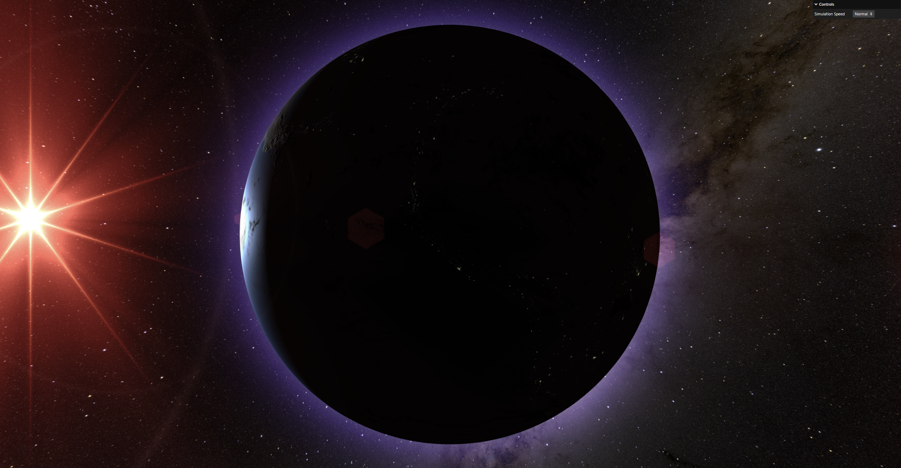

# globe.js
An interactive, realistic spinning globe three.js demo

## Live Demo
https://globe-js.vercel.app/

## Screenshot

## Acknowledgements
[Natural Earth III](https://www.shadedrelief.com/natural3/index.html): Textures provided by Tom Patterson.  
[Milky Way](https://svs.gsfc.nasa.gov/4851/): Texture provided NASA/Goddard Space Flight Center Scientific Visualization Studio.  
[Threejs Earth](https://github.com/franky-adl/threejs-earth): GLSL shader techniques provided by Franky Hung.  
[Lens Flare for Vanilla Threejs](https://github.com/ektogamat/lensflare-threejs-vanilla): Code provided by Anderson Mancini.